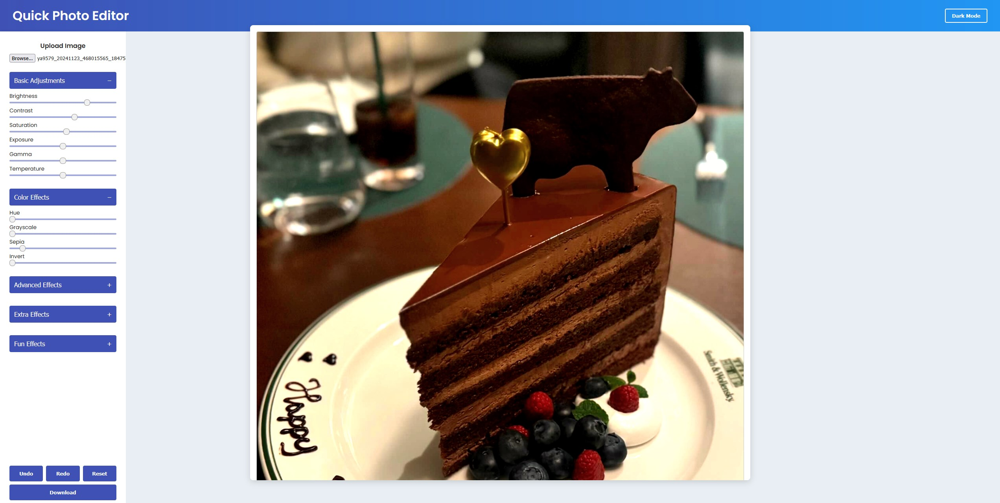

# Modern Photo Editor



## Overview

A quick web-based photo editor. This project integrates a wide range of image processing effects—from basic adjustments and color corrections to advanced and fun effects.

## Features

- **Basic Adjustments:**  
  - Brightness, Contrast, Saturation  
  - Exposure, Gamma, Temperature

- **Color Effects:**  
  - Hue Rotation, Grayscale, Sepia, Invert

- **Advanced Effects:**  
  - Blur, Rotate, Crop (placeholder), Sharpness  
  - Clarity, Noise Reduction, Highlights, Shadows  
  - Posterize, Emboss, Duotone, Vignette

- **Extra Effects:**  
  - Color Balance, Split Toning, Channel Mixer, Tone Curve  
  - Fisheye, Oil Painting

- **Fun Effects:**  
  - Pixelate, Comic, Sketch, Watercolor, Glow  
  - Mirror, Swirl, Kaleidoscope, Mosaic  
  - Solarize, Retro, Cartoon, Crystallize, Freeze Frame

- **Additional UI Features:**  
  - Dark Mode toggle for a better viewing experience.

- **State Management:**  
  - Undo, Redo, Reset, and Download options.


### Installation

1. **Clone the Repository:**

   ```bash
   git clone https://github.com/Saed-K/quick-photo-editor.git
   cd quick-photo-editor

2. **Open the App:** 

    Open index.html in your favorite web browser.
